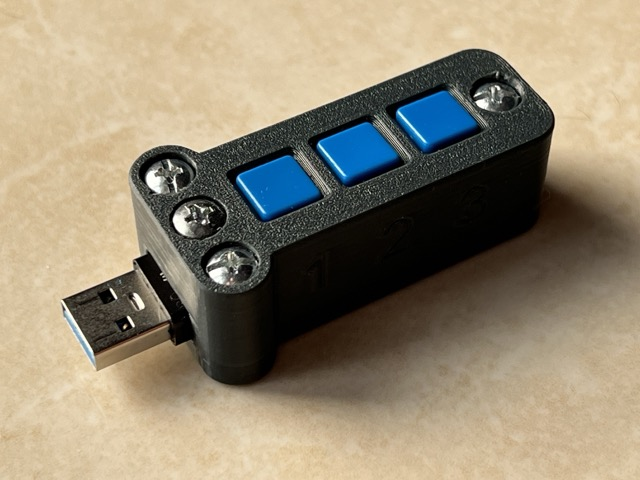
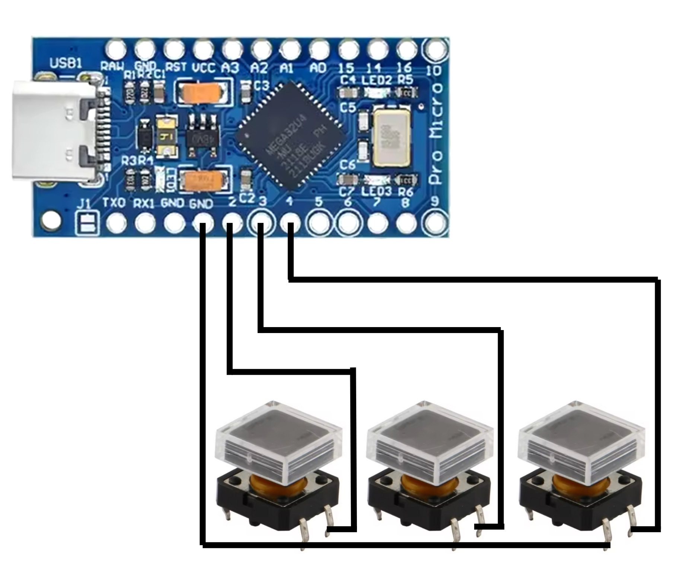
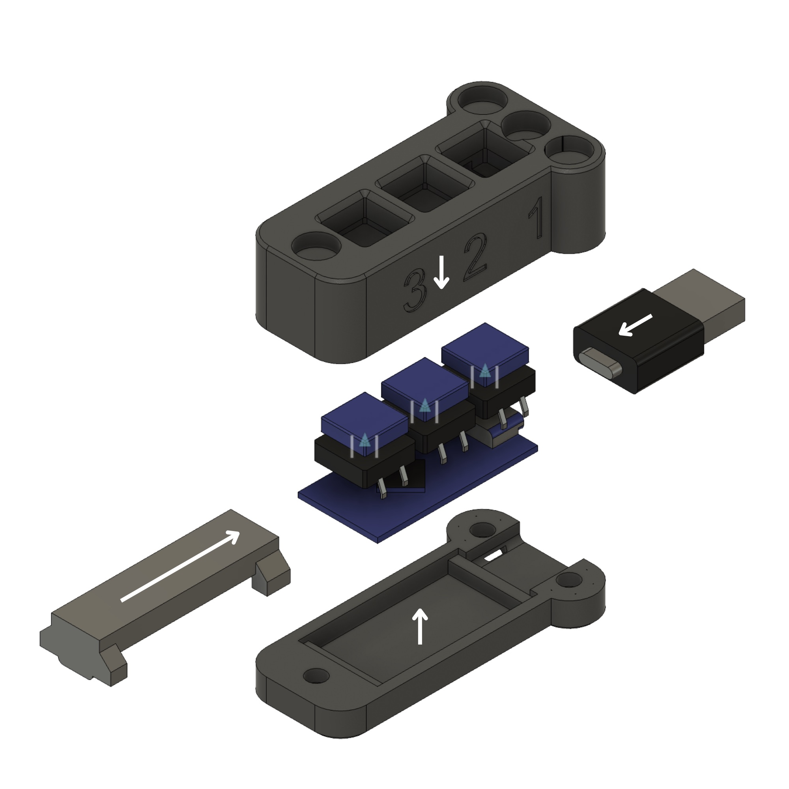

# HID Attack Demo

Project showcases HID attacks using Pro Micro board.

## BOM

1. Pro Micro Board with USB Type-C:
https://www.aliexpress.com/item/32808519179.html

2. Type C Male to USB Male Adapter:
 https://www.aliexpress.com/item/1005005565569345.html

3. 3 buttons:
https://www.aliexpress.com/item/1005008337159249.html

4. Electronic cable

5. M4 22 mm screws x4

6. M4 12 mm screw x1

7. M4 nuts x5

## Soldering

## Assembly

1. Print STL files using any filament
2. Solder according to scheme above
3. Screw the case alltogather

## Upload Sketch

Use Arduino IDE to upload the sketch to the Pro Micro board.

## Usage

Plug to Windows PC and press one of the buttons to execute attacks.